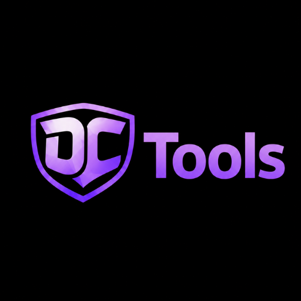
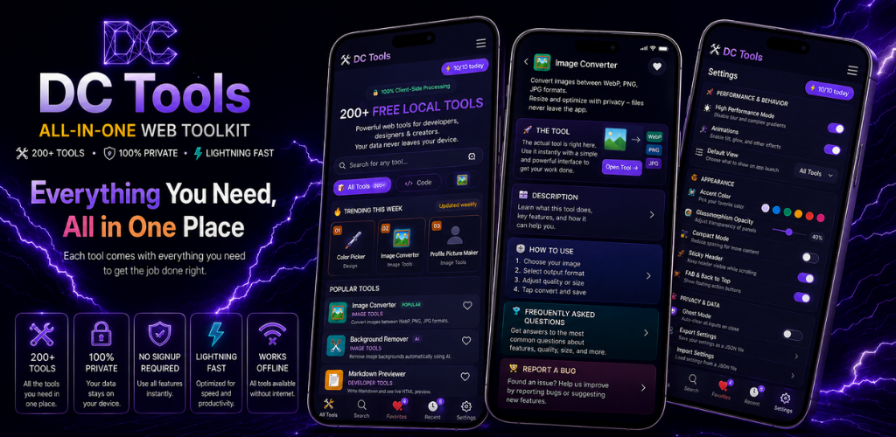
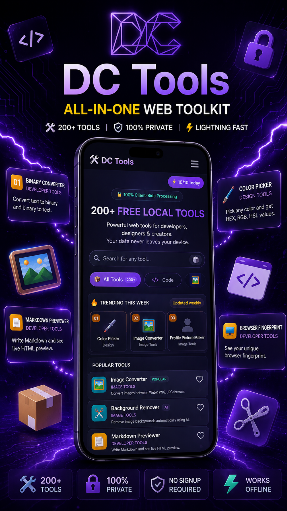
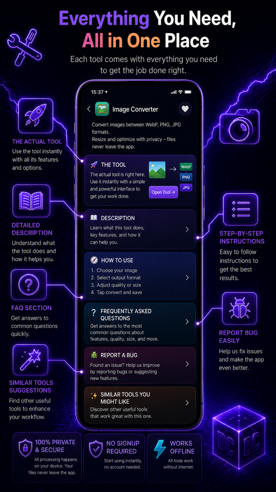
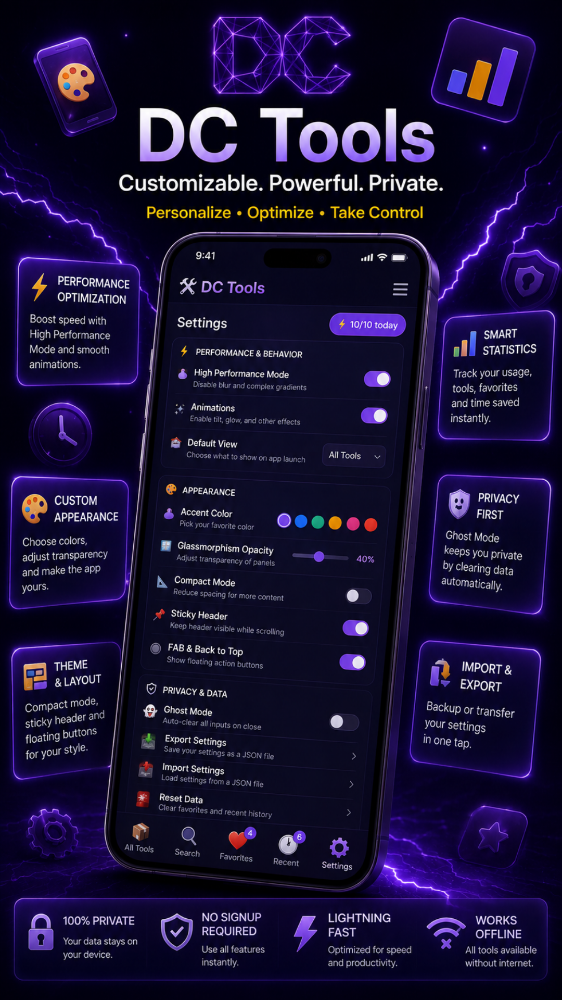

# 🛠️ DC Tools

### 200+ Utility Tools — Images, Text, Code & More

**A complete toolkit for developers, designers, students and creators.**  
Fast. Practical. Free with optional ad-removal Supporter plans.

 

---

---

## 🛠️ About DC Tools

**DC Tools** brings 200+ utilities together in one Android application.
Convert images, edit text, format code, generate content, calculate values,
and explore SEO, security and design helpers — in one convenient interface.

Many tools process files **locally on your device** and work offline once
their required resources are available. No app account is required.

> ### 🔔 Free App — Supported by Advertising
> DC Tools is free and supported by **Google AdMob** advertising.  
> **Supporter** removes ads while the one-time purchase remains valid.  
> **Supporter Monthly** removes ads while the subscription is active.  
> Premium Monthly and Premium Lifetime unlock features — they do **not** remove ads.

---

## ✨ Features

### 🖼️ Image Tools

- Image conversion and compression
- Photo editing, resizing and cropping
- Background removal
- Watermarks, memes and other creative utilities

### 📝 Text & Developer Tools

- Text formatting, sorting and transformation
- JSON formatting and developer helpers
- Regular expressions, encoding and binary utilities
- Code, CSS and API-related tools

### 🎨 Design, SEO & Everyday Utilities

| Category | Examples |
|---|---|
| **Design** | Colours, contrast, CSS and aspect ratios |
| **SEO** | Meta tags and marketing helpers |
| **Security** | Password generators and encoding tools |
| **Calculators** | Age, angles and everyday calculations |
| **Converters** | Units, images and text formats |

### 🔎 Find Your Tools Quickly

- **Search** with suggestions and category filters
- **Favorites** for tools you use often
- **Recent tools** for quick access
- **Trending tools** and curated categories
- Responsive layouts for phones and tablets
- Portrait orientation on phones; tablets can use portrait or landscape

### ⚡ Free Daily Usage

- **10 tool uses per day** across the app
- Daily counter resets automatically
- An optional **rewarded ad may grant +1 use**, when available
- Premium plans unlock unlimited daily usage

> Ad availability and consent choices may affect whether a rewarded ad is offered.

Interstitial ads are eligible after every six user-initiated page navigations,
with preloading near the threshold. At least 120 seconds separate interstitial
displays and requests; an unavailable ad is not forced onto the screen.
The navigation count is retained between app launches, and an interstitial
is never shown merely because the app opens.

---

## 👑 Premium Features

| Feature | Free | Premium |
|---|:---:|:---:|
| 200+ tools | ✅ | ✅ |
| Search, favorites and recent tools | ✅ | ✅ |
| Local processing for supported tools | ✅ | ✅ |
| **Unlimited daily usage** | ❌ | ✅ |
| **Split Screen** | ❌ | ✅ |
| **Appearance customization** | ❌ | ✅ |
| **Typography and text settings** | ❌ | ✅ |
| **Premium app icons** | ❌ | ✅ |
| Remove ads | ❌ | ❌ |

> **Only Supporter and Supporter Monthly remove ads.**
> Supporter Monthly also unlocks premium app icons.

---

## 💳 Pricing

DC Tools is **free** and supported by Google AdMob advertising.  
All paid plans are optional. Current localized prices are shown in the app
and in the Google Play purchase screen.

### One-Time Purchases

| Product | Price | Description |
|---|:---:|---|
| 💎 **Premium Lifetime** | Shown in app | Unlimited usage, Split Screen, appearance and typography customization, and premium app icons. **Does not remove ads.** |
| ❤️ **Supporter** | Shown in app | **Removes ads while the purchase remains valid.** A one-time contribution to support development; does not unlock Premium features. |

### Subscriptions

| Product | Price | Trial | Benefits |
|---|:---:|:---:|---|
| 👑 **Premium Monthly** | Shown in app | 7 days for eligible users | Unlimited usage · Split Screen · appearance and typography · premium app icons. **Does not remove ads.** |
| ❤️ **Supporter Monthly** | Shown in app | — | **Removes ads while active** · premium app icons |

> ❤️ Supporter plans help keep DC Tools free and actively developed.
> Ads may return after a refund or when a Supporter Monthly subscription expires.
> Subscriptions renew automatically until cancelled through Google Play.

---

## 🛡️ Privacy

DC Tools separates **tool content** from **advertising and purchase data:**

| | |
|---|---|
| 🔔 | Google AdMob banner, native, interstitial, app-open and rewarded ads |
| ✅ | Ads requested only when the Google consent process permits them |
| ✅ | Available advertising privacy choices can be reviewed in Settings |
| ❤️ | Supporter plans remove advertising while the entitlement is valid |
| 🔒 | Many tools process files locally on your device |
| ℹ️ | AdMob may process advertising identifiers, IP address, interactions and diagnostics |
| ✅ | Purchases managed by Google Play and RevenueCat |
| ✅ | Preferences, favorites and recent tools stored locally |
| ✅ | No app account required |

→ **[Official Privacy Policy](https://policy.rdcapps.com/dctools.html)**

---

## 🔗 Download

**[DC Tools on Google Play](https://play.google.com/store/apps/details?id=com.deniscasian.dctools)**

---

## 🌐 App Website

Find DC Tools and the other RDC Apps at **[rdcapps.com](https://rdcapps.com/)**.  
The Android app has its own daily usage, purchase and advertising features.

---

## 📄 Legal Documents

| Document | Description |
|---|---|
| [Privacy Policy](https://policy.rdcapps.com/dctools.html) ([repository copy](./PRIVACY_POLICY.md)) | Tool content, advertising data and purchase handling |
| [Terms of Use](https://terms.rdcapps.com/dctools.html) ([repository copy](./TERMS_OF_SERVICE.md)) | Rules for using DC Tools |
| [License](./LICENSE) | Proprietary software license |
| [Security Policy](./SECURITY.md) | How to report vulnerabilities |
| [Changelog](./CHANGELOG.md) | Feature and update history |
| [Support](./SUPPORT.md) | Help and contact information |

---

## 👤 Developer

**Denis Casian** — Independent developer, Romania 🇷🇴

| | |
|---|---|
| 🌐 Website | [rdcapps.com](https://rdcapps.com/) |
| 📧 Support | [support@rdcapps.com](mailto:support@rdcapps.com) |
| 🐛 Bug Reports | [bugs.rdcapps.com](https://bugs.rdcapps.com) |
| 📱 App | [DC Tools on Google Play](https://play.google.com/store/apps/details?id=com.deniscasian.dctools) |

---

Made with ❤️ for developers, designers and creators.

**[Download DC Tools](https://play.google.com/store/apps/details?id=com.deniscasian.dctools)** ·
**[Privacy Policy](https://policy.rdcapps.com/dctools.html)** ·
**[Terms of Use](https://terms.rdcapps.com/dctools.html)**

*© 2026 Denis Casian · DC Tools. All rights reserved.*

